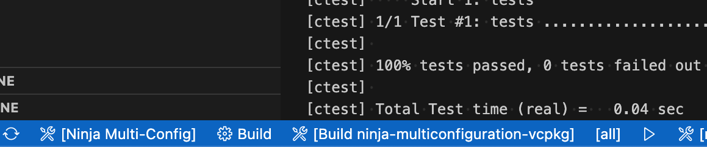

# A C++ project template based on CMake and vcpkg

## Content
This repository contains a `C++` based project template that leverages [vcpkg](https://github.com/microsoft/vcpkg) and [CMake](https://www.cmake.org)'s [CMakePresets.json](https://cmake.org/cmake/help/latest/manual/cmake-presets.7.html) to build and test `C++` source code.

Supports `Linux`/`macOS`/`Windows` on `x64` and `arm64` platforms.

`vcpkg` is driven to use its [binary caching](https://learn.microsoft.com/en-us/vcpkg/users/binarycaching) feature storing the content in the GitHub Action cache, hence speeding up workflows by reusing previously built packages.

## Key features:
 - `CMakePresets.json` allows to run the same build either _locally on your IDE_ and on _GitHub runners_.
 - `vcpkg` greatly helps in pulling and building the needed dependencies (e.g. libraries) which are cached for reuse on GitHub Action cache.

## GitHub Action workflows

The repository provides also two GitHub workflows to build the project on [GitHub runners](https://github.com/actions/runner). Both builds and tests the project using `vcpkg` and `CMake`, the only key difference is their implementation:

 - [hosted-pure-workflow.yml](.github/workflows/hosted-pure-workflow.yml): it is a __pure__ workflow which does not use unneeded GitHub Actions that cannot run locally on your development machine. On the other hand it is directly using the `CMake`, `Ninja`, `vcpkg` and the `C++ build` tools.
-  [hosted-ninja-vcpkg_submod.yml](.github/workflows/hosted-ninja-vcpkg_submod.yml): it is a concise workflow based on the custom GitHub Actions [get-cmake](https://github.com/lukka/get-cmake), [run-vcpkg](https://github.com/lukka/run-vcpkg) and [run-cmake](https://github.com/lukka/run-cmake) which simplify and shorten the workflow verbosity while adding some goodies like vcpkg binary caching stored on GH's cache and inline error annotations.

## Rationale

The main idea of this `C++` project template is to show how to obtain a _perfectly reproducible_ software development process that can be run anywhere without any difference and no surprises, either locally using your preferred tools/IDE, either remotely on build agents typically used for continuous integration.

## Integrated Development Environment (IDE) Support

The major `C++` IDEs should already support `CMakePresets.json` and require no particular configuration. 

For example [Visual Studio Code](https://code.visualstudio.com/) with the [CMake Tools extension](https://marketplace.visualstudio.com/items?itemName=ms-vscode.cmake-tools) let you to open the root folder of this repository, and select in the status bar the CMake preset (e.g. `ninja-multi-vcpkg`), as show in the following image:

 

# License

All the content in this repository is licensed under the [MIT License](LICENSE.txt).

Copyright © 2021-2022-2023 Luca Cappa
